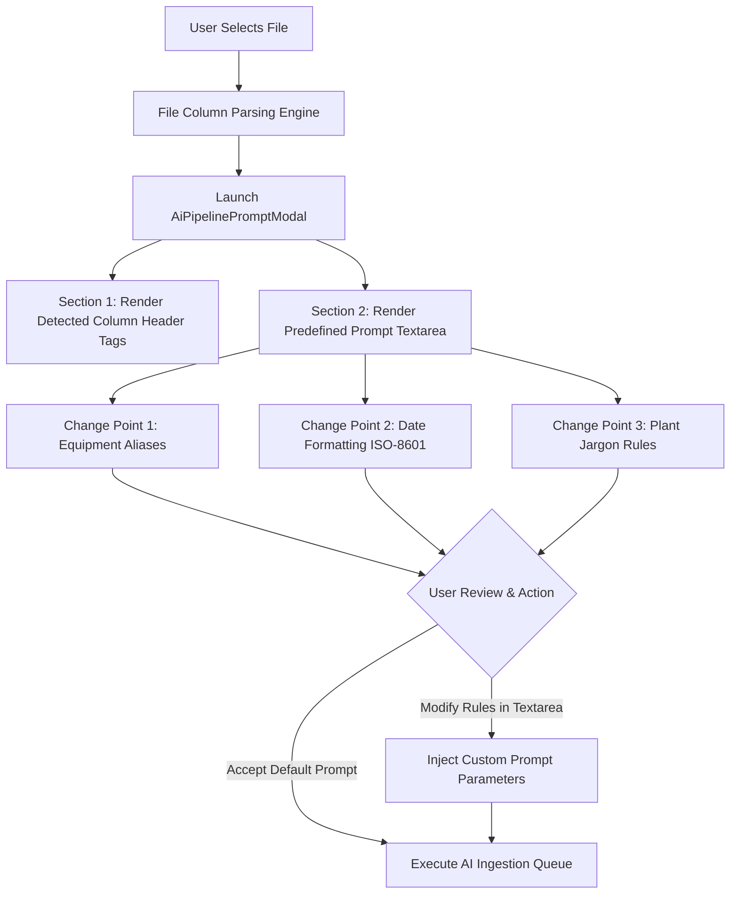

# Software Requirements Specification (SRS)

## AI Prompts & Change Points Configuration System

---

### Document Control

| Item | Details |
| :--- | :--- |
| **Document Title** | SRS: Pre-Upload Column Report & Editable AI Prompts with Change Points |
| **System Feature** | Pre-Upload AI Pipeline Modal (`AiPipelinePromptModal`) |
| **Core AI Engine** | GPT Opus 120B Large Language Model |
| **Document Version** | 1.0.0 (Pre-Implementation Baseline) |
| **Target Audience** | Domain Experts, System Administrators, QC Engineers |

---

## 1. Functional Scope & Individual Flow Diagram

### 1.1 Objective
When uploading datasets through the AI Pipeline, operators MUST be presented with a **Pre-Upload Column Summary Report** displaying all detected input columns. Immediately below the report, the system MUST display a **Predefined System Prompt** configured with defined Change Points. Operators can review and customize extraction rules prior to executing pipeline processing.

### 1.2 Individual Module Flow Diagram

---

## 2. Component Requirements

### 2.1 Detected Column Summary Report Page
- **Requirement**: Displays an interactive summary of all column headers parsed from the selected input file.
- **QC Verification**: Ensure column count and header labels match source file headers exactly.

### 2.2 Predefined AI Prompt & Change Points Component
- **Requirement**: Displays an editable prompt template containing domain rules for the **GPT Opus 120B** model:
  - **Change Point 1: Equipment Alias Normalization** (e.g., mapping "R203" to "0303. R2 Coater").
  - **Change Point 2: Date Formatting Directive** (enforcing ISO-8601 `YYYY-MM-DD`).
  - **Change Point 3: Jargon Translation Directive** (standardizing plant abbreviations).
- **User Control**: The prompt box MUST be fully editable by the user before initiating extraction.

---

## 3. QC Testing & Acceptance Criteria

- **Report Display Verification**: Modal MUST display detected columns accurately before pipeline execution.
- **Editable Prompt Verification**: User modifications to the prompt text MUST be passed into the extraction run.
- **Change Point Effect Verification**: QC testers MUST confirm that custom rules added to the prompt take effect during data extraction.
