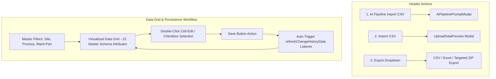

# Software Requirements Specification (SRS)

## Change History Data Management Module

---

### Document Control

| Item | Details |
| :--- | :--- |
| **Document Title** | SRS: Change History Data Management Workspace |
| **System Module** | EQUAL Data Management Subsystem (`/data-management/change-history-data`) |
| **Document Version** | 1.0.0 (Pre-Implementation Baseline) |
| **Target Audience** | Software Engineers, QA / QC Test Engineers, Enterprise Solution Architects |

---

## 1. Executive Summary & Individual Flow Diagram

### 1.1 Purpose
The **Change History Data Management Module** serves as the central operational hub for managing, viewing, filtering, inline-editing, batch-deleting, importing, and exporting standardized equipment maintenance records (`ChangeData`).

### 1.2 Individual Module Flow Diagram

---

## 2. Functional Requirements

### 2.1 Header Action Bar Sequence
- **Req-1.1 Action Button Ordering**: The top action bar MUST render buttons in strict left-to-right order:
  1. **AI Pipeline Import CSV**
  2. **Import CSV**
  3. **Export** (Dropdown for CSV, Excel, and Targeted ZIP)
- **Req-1.2 User Identity Tracking**: AI Pipeline import requests MUST capture and attach the authenticated operator's user name.

### 2.2 Predefined Master Data Schema (22 Attributes)
The module MUST manage records according to the 22 standardized master columns:
`Site`, `Process`, `Maintenance Part`, `Equipment Code`, `Equipment Name`, `W/O Code`, `Report Content`, `BOM`, `Spare Part`, `Work Date`, `Improvement Work`, `Work Purpose`, `Problem Symptom`, `Problem Cause`, `HW Before`, `HW After`, `SW Before`, `SW After`, `Representative Work`, `Priority`, `Category`, `Wotype`.

### 2.3 Export Functions & Targeted ZIP Package
- **Req-3.1 CSV & Excel Export**: Exports selected table rows (or all filtered rows if none selected) as `.csv` or `.xlsx`.
- **Req-3.2 Targeted ZIP Export**: When the user selects specific rows via table checkboxes, ZIP Export MUST export only the selected record IDs. If no rows are selected, it exports the default record set.

### 2.4 Automatic Data Refresh
- **Req-4.1 Navigation & Event Triggers**: Navigating to Change History or saving changes in preview modals MUST automatically trigger a data refresh so that table records and dropdown filters reflect the latest state immediately.

---

## 3. QC Testing & Acceptance Criteria

- **UI Button Order Test**: Verify that **AI Pipeline Import CSV**, **Import CSV**, and **Export** appear in exact order.
- **Mandatory Field Highlighting Test**: Confirm that only mandatory fields (`Site`, `Process`, `Maintenance Part`, `Equipment Code`, `Equipment Name`, `Representative Work`, `Priority`, `Category`) are highlighted in red when empty.
- **Targeted ZIP Export Test**: Verify that selecting row checkboxes exports a ZIP file containing only those selected records.
