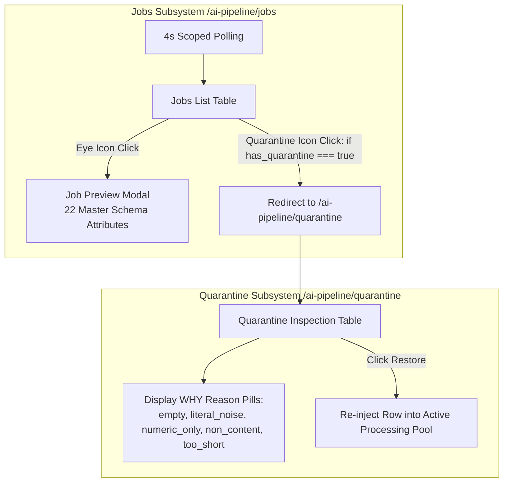

# Software Requirements Specification (SRS)

## AI Pipeline Jobs & Quarantine Modules

---

### Document Control

| Item | Details |
| :--- | :--- |
| **Document Title** | SRS: Jobs Execution Tracking & Quarantine Subsystems |
| **System Modules** | EQUAL AI Pipeline Subsystem (`/ai-pipeline/jobs` & `/ai-pipeline/quarantine`) |
| **Document Version** | 1.0.0 (Pre-Implementation Baseline) |
| **Target Audience** | Software Engineers, AI Pipeline Developers, QA / QC Test Engineers |

---

## 1. Executive Summary & Individual Flow Diagram

### 1.1 Purpose
The **Jobs Module** and **Quarantine Module** work in tandem to provide asynchronous job tracking, export verification, and isolated row restoration for all multi-format AI data extraction runs.

### 1.2 Individual Module Flow Diagram

---

## 2. Jobs Module Specifications (`/ai-pipeline/jobs`)

### 2.1 Real-Time Job Polling
- **Req-1.1 Polling Scope**: The system MUST poll for job status updates every 4 seconds **only while the Jobs page is active**.
- **Req-1.2 Polling Cleanup**: Navigating away from Jobs MUST stop background polling immediately.

### 2.2 Table Actions
- **Req-2.1 Eye Icon Preview**: Clicking the Eye icon opens a preview modal rendering extracted rows mapped to the 22 master schema attributes, highlighting missing mandatory fields and enabling inline cell editing.
- **Req-2.2 Conditional Quarantine Icon**: The Quarantine icon button MUST be enabled **only** when `has_quarantine` is `true`. When `has_quarantine` is `false`, the button MUST be disabled and grayed out. Clicking an enabled Quarantine button MUST navigate to `/ai-pipeline/quarantine`.

---

## 3. Quarantine Module Specifications (`/ai-pipeline/quarantine`)

### 3.1 Reasoning Mapping (`WHY` Dictionary)
- Quarantined items MUST display reason explanations mapped from the `WHY` dictionary:
  - `empty`: *"The report cell was blank, or held nothing but codes and dates."*
  - `literal_noise`: *"The text matched a placeholder phrase (N/A, 없음, 확인중, TBD…)."*
  - `numeric_only`: *"The text was only digits."*
  - `non_content`: *"The text was only punctuation or symbols."*
  - `too_short`: *"Fewer than the minimum characters once codes and dates were removed."*

### 3.2 Table & Restoration Flow
- **Req-3.1 Table Columns**: `Source` (file name, row number), `W/O code`, `Process · Equipment`, `What the cell held`, `Why` (reason badge + explanation text), and `Action` (Restore button or status).
- **Req-3.2 Restore Action**: Clicking **Restore** puts the row back as a valid report in the active processing pool.

---

## 4. QC Testing & Acceptance Criteria

- **Jobs Polling Lifecycle Test**: Confirm polling starts on entering Jobs page and stops immediately upon leaving.
- **Quarantine Icon Enable/Disable Test**: Verify Quarantine button is enabled only for jobs with `has_quarantine === true`.
- **Quarantine Restore Test**: Confirm clicking **Restore** successfully restores non-blank quarantined rows.
