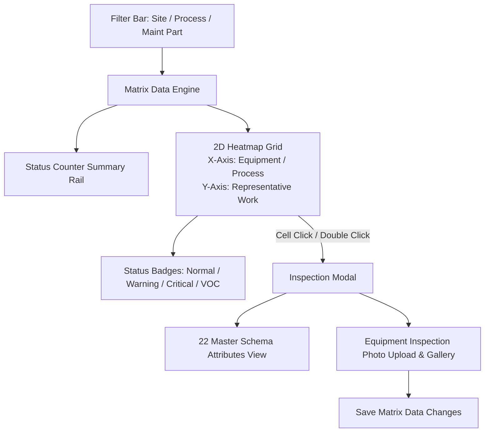

# Software Requirements Specification (SRS)

## Matrix Inquiry Module

---

### Document Control

| Item | Details |
| :--- | :--- |
| **Document Title** | SRS: Matrix Inquiry & Equipment Heatmap Module |
| **System Module** | EQUAL Change Matrix Subsystem (`/change-matrix/matrix-inquiry`) |
| **Document Version** | 1.0.0 (Pre-Implementation Baseline) |
| **Target Audience** | Data Visualization Engineers, Maintenance Managers, QC Test Engineers |

---

## 1. Executive Summary & Individual Flow Diagram

### 1.1 Purpose
The **Matrix Inquiry Module** provides an interactive 2D Heatmap Grid cross-referencing equipment assets against representative work activities, enabling plant engineers to visualize maintenance frequency, operational status, and VOC (Voice of Customer) complaint flags.

### 1.2 Individual Module Flow Diagram

---

## 2. Functional Requirements

### 2.1 2D Heatmap Matrix Grid
- **Req-1.1 Axis Alignment**: X-Axis represents Equipment Items / Process Steps; Y-Axis represents Representative Work Items.
- **Req-1.2 Status Color-Coding**:
  - `Normal`: Green badge.
  - `Warning / Frequent`: Amber badge.
  - `Critical / VOC Flagged`: Red badge.

### 2.2 Inspection Modal & Media Attachments
- **Req-2.1 Detail Inspection**: Clicking a matrix cell opens a modal displaying detailed work order records across the 22 master schema fields.
- **Req-2.2 Photo Attachments**: Supports uploading, viewing, and managing equipment inspection photos.

---

## 3. QC Testing & Acceptance Criteria

- **Filter Synchronization**: Grid MUST reload dynamically when Site or Process filter selections change.
- **Heatmap Color Accuracy**: Status color badges MUST accurately reflect equipment criticality and VOC status.
- **Photo Upload Verification**: Attached inspection photos MUST render correctly within the cell detail modal.
