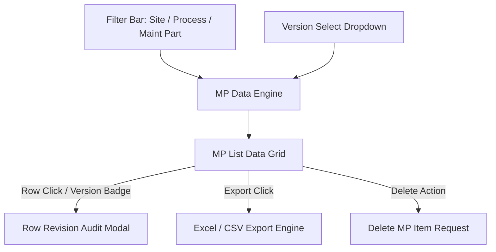

# Software Requirements Specification (SRS)

## Maintenance Plan (MP) List Inquiry Module

---

### Document Control

| Item | Details |
| :--- | :--- |
| **Document Title** | SRS: Maintenance Plan (MP) List Inquiry Module |
| **System Module** | EQUAL Change Matrix Subsystem (`/change-matrix/mp-list-inquiry`) |
| **Document Version** | 1.0.0 (Pre-Implementation Baseline) |
| **Target Audience** | Software Engineers, Maintenance Leads, QC Auditors |

---

## 1. Executive Summary & Individual Flow Diagram

### 1.1 Purpose
The **MP List Inquiry Module** provides maintenance engineers and auditors with a comprehensive interface to query, filter, compare versions, and audit revision histories of Maintenance Plan (MP) records across manufacturing facilities.

### 1.2 Individual Module Flow Diagram

---

## 2. Functional Requirements

### 2.1 Multi-Criteria Data Grid
- **Req-1.1 Filtering**: Dynamically filter MP items by Site, Process, Maintenance Part, and active Version.
- **Req-1.2 Master Attributes**: Display Equipment Code, Equipment Name, Representative Work, Version Numbers, and Active Status.

### 2.2 Version Management & Revision Audit
- **Req-2.1 Version Switching**: Support switching active MP versions from a dropdown menu.
- **Req-2.2 Row Revision Audit**: Clicking a row's version badge opens a historical audit modal displaying past modifications to that specific MP item.
- **Req-2.3 Delete MP Item**: Support removing individual MP records with confirmation.

---

## 3. QC Testing & Acceptance Criteria

- **Version Switch Test**: Changing active version MUST update all grid rows immediately.
- **Revision History Test**: Opening row revision history MUST display all historical changes in chronological order.
- **Deletion Audit Test**: Deleting an item MUST remove it from the active view.
