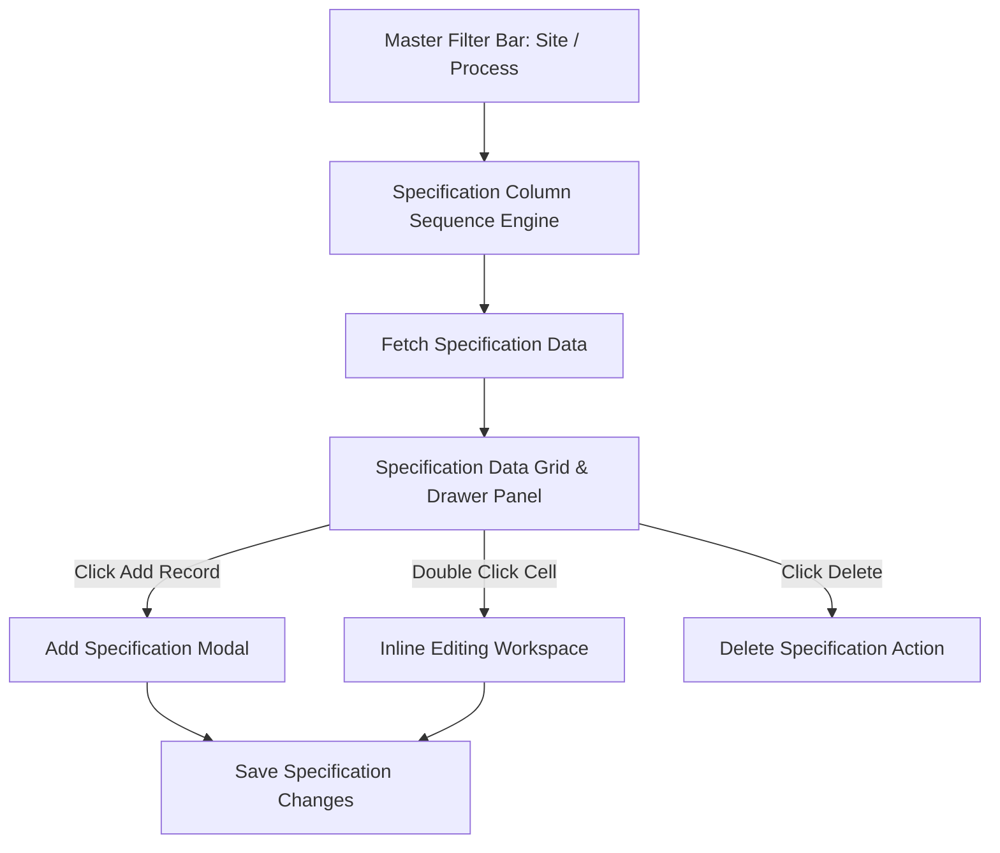

# Software Requirements Specification (SRS)

## Maintenance Plan (MP) List Management Module

---

### Document Control

| Item | Details |
| :--- | :--- |
| **Document Title** | SRS: MP List & Specification Data Management Workspace |
| **System Module** | EQUAL Change Matrix Subsystem (`/change-matrix/mp-list-management`) |
| **Document Version** | 1.0.0 (Pre-Implementation Baseline) |
| **Target Audience** | System Administrators, Specification Engineers, QC Test Engineers |

---

## 1. Executive Summary & Individual Flow Diagram

### 1.1 Purpose
The **MP List Management Module** serves as the primary authoring workspace for configuring, editing, reordering, adding, deleting, and persisting Maintenance Plan (MP) and Specification Data records (`SpecData`).

### 1.2 Individual Module Flow Diagram

---

## 2. Functional Requirements

### 2.1 Specification Master Column Ordering Engine
- **Req-1.1 Master Column Definitions**: Loads specification master column definitions.
- **Req-1.2 Sequence Ordering**: Grid columns MUST be ordered strictly by `sequence`, guaranteeing uniform attribute order across all plant views.

### 2.2 Authoring & Workspace Management
- **Req-2.1 Add Record**: Provides an **Add Record** modal allowing operators to define new equipment parameters.
- **Req-2.2 Inline & Drawer Editing**: Supports double-click inline cell editing and drawer panel editing.
- **Req-2.3 Delete Record**: Supports deleting individual specification items with confirmation.

---

## 3. QC Testing & Acceptance Criteria

- **Column Sequence Test**: Verify that grid columns appear in exact order defined by column sequence numbers.
- **Add & Save Test**: Adding a specification record MUST immediately update the workspace grid.
- **Delete Test**: Deleting a record MUST remove it from the active dataset.
