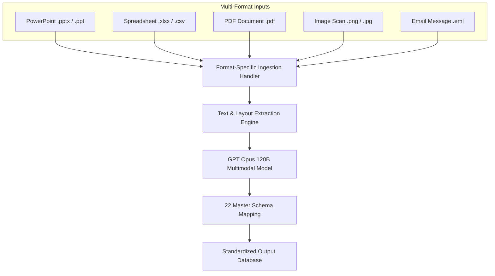

# Software Requirements Specification (SRS)

## Multi-Format File Processing System

---

### Document Control

| Item | Details |
| :--- | :--- |
| **Document Title** | SRS: Multi-Format File Ingestion & Document Processing System |
| **Supported File Formats** | PPT/PPTX, Excel (XLSX/XLS/CSV), PDF, Images (PNG/JPG), EML Emails |
| **Primary AI Inference Engine** | GPT Opus 120B Large Language Model |
| **Document Version** | 1.0.0 (Pre-Implementation Baseline) |
| **Target Audience** | Systems Engineers, Integration Architects, QA Testers |

---

## 1. Functional Scope & Individual Flow Diagram

### 1.1 Objective
The Multi-Format File Processing System provides a unified ingestion framework capable of extracting operational maintenance records from multi-modal source documents.

### 1.2 Individual Module Flow Diagram

---

## 2. Ingestion Specifications by File Format

### 2.1 PowerPoint Presentation Decks (PPT / PPTX)
- **Requirements**:
  - Extract text contents from slides, text boxes, callout shapes, and embedded tables.
  - Parse slide titles to contextualize maintenance activity locations.

### 2.2 Spreadsheets (XLSX / XLS / CSV)
- **Requirements**:
  - Auto-detect table boundaries, multi-header rows, and merged cells.
  - Parse multiple worksheets within a single workbook.

### 2.3 PDF Inspection Reports (PDF)
- **Requirements**:
  - Process both native digital PDFs and scanned image-based PDFs.
  - Retain tabular layout structures during text extraction.

### 2.4 Diagnostic Images & Photos (PNG / JPG)
- **Requirements**:
  - Extract text embedded within maintenance screenshots, equipment nameplates, and meter readings.
  - Feed visual context directly to the multimodal AI processing pipeline.

### 2.5 Email Communications (EML)
- **Requirements**:
  - Extract email headers (Sender, Date, Subject) and body text.
  - Process attached documents (e.g., attached spreadsheets or PDF reports).

---

## 3. QC Testing & Acceptance Criteria

- **Format Resilience Test**: The system MUST process all 5 supported file types in a single execution queue without failing.
- **Data Completeness Test**: Extracted fields from all file types MUST map into the 22 master schema attributes.
- **Error Handling**: Corrupt or unreadable files MUST generate a clear error message and isolate affected items into Quarantine.
