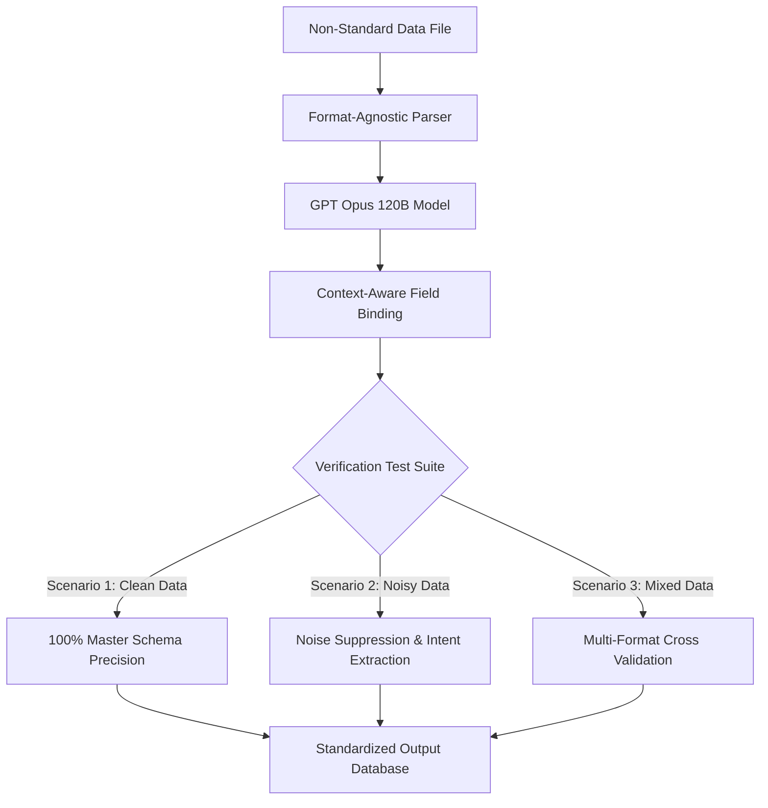

# Software Requirements Specification (SRS)

## Non-Standard Format Data Extraction System & Verification Engine

---

### Document Control

| Item | Details |
| :--- | :--- |
| **Document Title** | SRS: System for Extracting Data from Non-Standard Formats & Performance Validation |
| **System Module** | Data Extraction & Verification Engine |
| **Primary AI Engine** | GPT Opus 120B Large Language Model |
| **Document Version** | 1.0.0 (Pre-Implementation Baseline) |
| **Target Audience** | Software Architects, QA Lead Engineers, Data QC Testers |

---

## 1. Executive Summary & Individual Flow Diagram

### 1.1 Purpose
Legacy plant maintenance logs are frequently stored in non-standard formats with irregular layout patterns, merged spreadsheet cells, informal column titles, and varying terminology. This specification defines the requirements for a resilient extraction system capable of interpreting non-standard inputs, normalizing raw content into standardized schemas, and validating extraction accuracy using defined verification test suites.

### 1.2 Individual Module Flow Diagram

---

## 2. Theoretical Processing Logic

1. **Format Agnostic Parsing**: The system parses input documents regardless of layout structure or custom column names.
2. **Context-Aware Field Binding**: Using deep semantic understanding provided by **GPT Opus 120B**, non-standard column headers (e.g., "설비명칭", "Machine ID", "작업내용") are automatically mapped to standard target fields (`Equipment Name`, `Equipment Code`, `Report Content`).
3. **Validation & Isolation**: Entries failing basic mandatory constraints are highlighted for user review or isolated in Quarantine.

---

## 3. Quality Control (QC) Verification Test Scenarios

Quality Control engineers MUST evaluate system performance across three specific verification scenarios:

### 3.1 Verification Scenario 1: Clean Data Benchmark
- **Input Specification**: Standardized files with clear column headers and complete entries.
- **Expected QC Outcome**:
  - Zero missing mandatory fields (`Site`, `Process`, `Maintenance Part`, `Equipment Code`, `Equipment Name`, `Representative Work`, `Priority`, `Category`).
  - 100% correct data type enforcement (e.g., ISO date formatting).

### 3.2 Verification Scenario 2: Noisy Data Benchmark
- **Input Specification**: Files containing OCR noise, placeholder tokens ("N/A", "확인중", "TBD"), text truncations, and informal slang.
- **Expected QC Outcome**:
  - Automatic suppression of meaningless noise tokens.
  - Accurate extraction of real underlying maintenance intent.
  - Flagging incomplete records without causing processing failures.

### 3.3 Verification Scenario 3: Mixed Data Benchmark
- **Input Specification**: Batch uploads combining spreadsheets, presentation decks, PDF invoices, image scans, and email messages.
- **Expected QC Outcome**:
  - Unified output dataset standardized to the master target schema.
  - Zero data loss or corruption during multi-format batch ingestion.

---

## 4. Operational Requirements

- **Accuracy Threshold**: Minimum 95% field extraction accuracy on noisy data inputs.
- **Fault Tolerance**: Malformed rows MUST be quarantined without breaking the pipeline.
- **Auditability**: All extraction actions MUST retain line-level source traceability.
