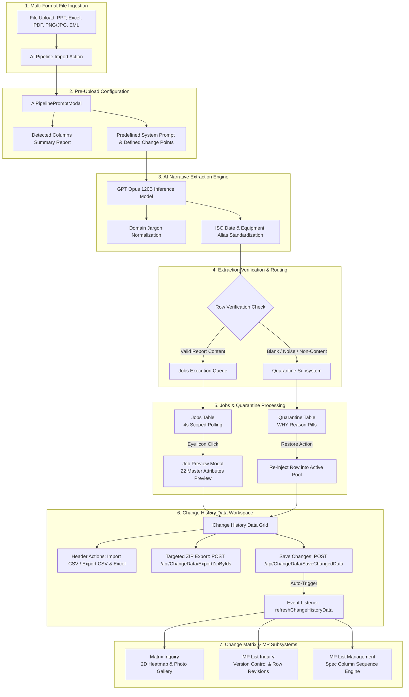

# System Specification: End-to-End Flow Diagram & Data Lifecycle

---

## 1. System Architecture & Workflow Diagram

This document illustrates the complete end-to-end operational flow of the EQUAL system—from initial multi-format file upload through AI narrative extraction, job monitoring, quarantine handling, master schema standardization, change history management, matrix heatmap visualization, and maintenance plan (MP) versioning.

---

## 2. Stage-by-Stage Operational Summary for QC Testing

| Stage # | Stage Name | System Action | QC Verification Expectation |
| :-: | :--- | :--- | :--- |
| **1** | **Multi-Format Ingestion** | Ingests `.xlsx`, `.csv`, `.pdf`, `.pptx`, `.png`, `.eml` files. | System accepts all 5 supported file types without rejection. |
| **2** | **Pre-Upload Report** | Displays column headers and editable prompt with Change Points. | Column summary tags match input file headers exactly. |
| **3** | **AI Extraction** | GPT Opus 120B maps text to 22 master schema columns. | Jargon normalized; dates converted to ISO-8601 (`YYYY-MM-DD`). |
| **4** | **Routing & Isolation** | Valid rows sent to Jobs; blank/noise sent to Quarantine. | Invalid/empty rows isolated without breaking the job run. |
| **5** | **Jobs & Quarantine** | 4s polling on Jobs; Restore action on Quarantine. | Polling active only on Jobs page; Restore returns row to pool. |
| **6** | **Change History Data** | 22-attribute grid editing, targeted ZIP export by IDs. | Selected checkbox IDs exported in ZIP package. |
| **7** | **Matrix & MP Modules** | Heatmap status badges, MP versioning, column sequence. | Column order strictly matches sequence numbers. |
